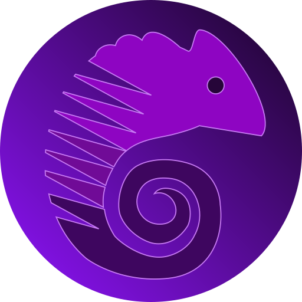

<p align="center">
	
</p>
<h1 align="center">Chameleon</h1>
<p align="center">Script to resolve the master mind game</p>

## Setup
1. Go to your preferred directory download the [MasterMind](https://github.com/Amauryh24/MasterMind) game
2. Download the latest version of chameleon [here](https://github.com/KhashayarKhm/chameleon/releases/latest)
3. Move the chameleon to the master mind game directory
4. Include the `chameleon.js` to the `index.html` of master mind game with an text editor (Atom, notepad, vim, ...)
	```index.html
				</section>
				<script src="./assets/js/mastermind.js"></script>
				<script src="./chameleon/chameleon.js"></script>
			</body>
		</html>
	```
5. Run the `index.html` in your browser and have fun :)

## WARNING
- This script is **only** available in [MasterMind](https://github.com/Amauryh24/MasterMind)
- Do **NOT** change, add or remove the elements, IDs or classes to chameleon work well
- Chameleon only works in easy difficulty for now

## Thanks
- The logo made by [Game-icons](https://www.game-icons.net)
- The master mind game made by [Amauryh24](https://github.com/Amauryh24)
